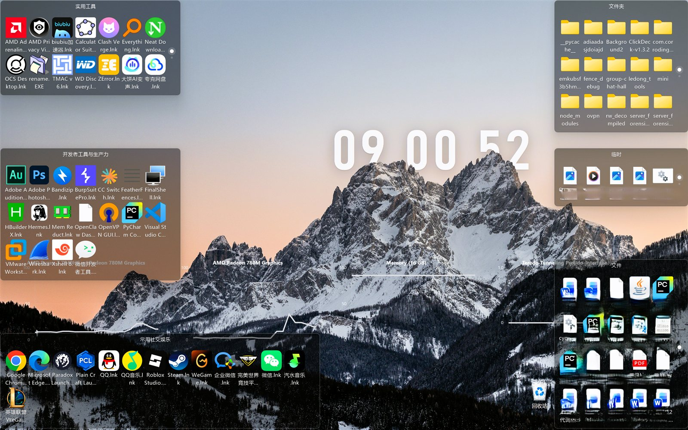
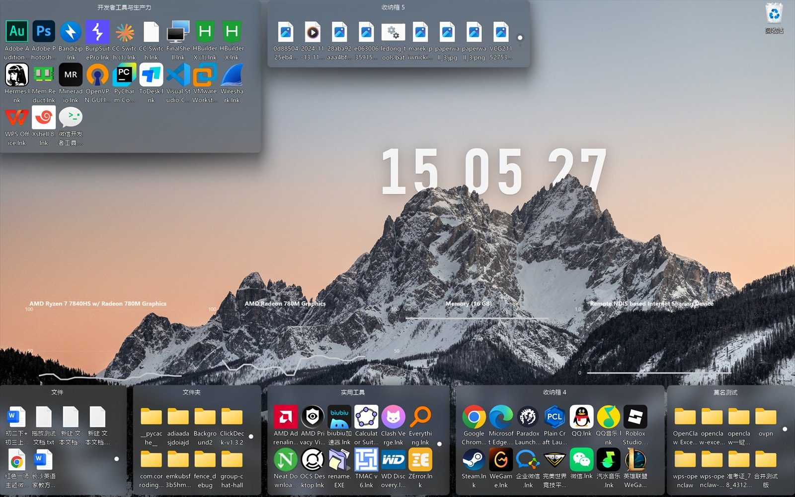

# FeatherFences · 轻栅栏

> 超轻量桌面分区整理工具 —— 用 Rust 从零实现的 Fences 轻量版。内存占用极低,风格透明克制,不联网、不上传任何数据。

**分层模式(默认)** —— 逐像素 Alpha,背景直透桌面:



**亚克力模式** —— 系统材质,自带模糊与噪点:



## ✨ 特性

- **两种渲染模式,托盘一键切换** —— **分层模式**(默认)逐像素 Alpha 直透桌面;**亚克力模式**改用 DWM 系统材质,整块背景交给系统合成亚克力(自带模糊、噪点与明暗自适应),标题/图标/文字照常绘制。切换后全部栅栏原地重建,选择写入配置、重启保持。两种模式共用同一套绘制代码,**分层模式行为零改动**。
- **真透明背景(分层模式)** —— 半透明面板是**真透明**、直接透出桌面,无磨砂、无 DWM 特效;内容(标题/图标)不透明。整幅替换每帧提交,不残留拖影。
- **图标网格 + 文字标签** —— 以文件系统目录为内容源,栅栏内按网格排布图标与名称。
- **拖入 / 拖出** —— 通过 OLE `IDropTarget` 把桌面或资源管理器的文件拖进栅栏,也可从栅栏拖出;文件夹门户实时跟随目录内容刷新。
- **文件夹栅栏 & 收纳栅栏** ——「文件夹栅栏」绑定任意目录做门户;「收纳栅栏」自动在配置目录下创建独立收纳箱,不再共享目录。
- **翻页 + 分页圆点** —— 图标超过一页自动分页,滚轮 / 触控板平滑翻页(cubic ease-out 动画),右侧圆点随页平滑缩放。
- **幽灵模式** —— 未悬停时整体淡出至 16% 透明度(逐像素 Alpha 直接透出桌面),鼠标靠近即还原。
- **禅模式 / 一键隐藏** —— 隐藏所有栅栏，可通过托盘菜单或全局快捷键切换；默认保留 `Ctrl+Alt+Z`，可在托盘中修改或禁用，热键冲突时保留原有可用设置。
- **桌面清扫** —— 按 `sweep_rules` 规则把桌面散落文件自动归类到对应收纳箱。
- **快捷方式自动收纳** —— 程序运行后桌面新增的 `.lnk` 写入稳定后会自动移入用户收纳箱；优先选择快捷方式占比最高的箱子，占比相同则选择快捷方式更多的箱子。
- **下载收纳箱** —— 自动创建专用收纳箱；程序启动后新出现在桌面的文件会在写入稳定后自动移入，浏览器临时下载文件不会被提前截断。
- **桌面图标避让** —— 把栅栏覆盖的桌面区域设为禁放区,Explorer 原生桌面图标自动**就近**搬移到最近空闲网格:以图标当前位置为圆心搜索,不打乱既有布局。开启后关闭系统自动排列(否则搬走的图标会被吸回禁放区),关闭时按开启前的原始状态原样恢复——你手动关过自动排列的自定义布局不会被强制吸附。托盘菜单提供「撤销并关闭避让」一键回退:**被搬走的图标与被移动/缩放的栅栏同时恢复原状**。搬移记录带 1 分钟存活期,超时视为图标已在新位置稳定、不再回退,长期开启不会累积内存。
- **开机自启** —— 写注册表 `HKCU\...\Run`,可选开关。
- **配置持久化** —— JSON 配置文件,内存极小、启动即现,支持热重载。

## 🛠️ 技术栈

| 模块 | 实现 |
| --- | --- |
| 语言 | Rust (edition 2024),纯 Win32 无框架依赖 |
| Windows API 绑定 | [`windows` crate 0.62](https://crates.io/crates/windows)(零安全抽象层之上的原生 FFI) |
| 分层渲染(模式 1) | `UpdateLayeredWindow` + 32bpp 预乘 Alpha DIB,`WS_EX_LAYERED \| WS_EX_TOOLWINDOW \| WS_EX_NOACTIVATE`,`DWMWA_WINDOW_CORNER_PREFERENCE` 圆角 |
| 亚克力渲染(模式 2) | 非分层窗口 + `WS_EX_NOREDIRECTIONBITMAP` + `WS_CAPTION`(`WM_NCCALCSIZE` 收掉非客户区,外观仍无边框),`DWMWA_SYSTEMBACKDROP_TYPE = DWMSBT_TRANSIENTWINDOW` 请系统材质;内容经 DirectComposition `IDCompositionSurface` 整幅提交 |
| 绘制 | GDI+(`Gdip*`)绘制半透明面板 / 文字 / 网格,GDI `DrawIconEx` 绘制图标(原生掩码/Alpha 处理,透明区正确) |
| 图标抽取 | `SHGetFileInfoW`(`SHGFI_SYSICONINDEX`)+ `SHGetImageList` 取 32bpp Alpha 图标,EXTRALARGE/LARGE 兜底,LRU 缓存(512 个) |
| 拖放 | OLE `IDropTarget` / `DoDragDrop` |
| 目录监听 | `ReadDirectoryChangesW`,文件夹门户实时刷新 |
| 开机自启 | [`winreg`](https://crates.io/crates/winreg) 写注册表 Run 键 |
| 配置 | [`serde`](https://crates.io/crates/serde) / `serde_json`,存于 `%APPDATA%\feather-fences\config.json` |
| 消息循环 | 原生 Win32 消息泵 + 定时器驱动重绘与翻页动画 |

发布配置:`opt-level=3` + LTO(`thin`)+ `codegen-units=1` + `strip` + `panic=abort`,追求极致体积与性能。

## 🚀 构建

```bash
cargo build --release
# 产物:target/release/feather-fences.exe,双击即可运行
```

> 仅支持 Windows 10/11(x64)。运行时会自动在 `%APPDATA%\feather-fences\` 下创建配置与收纳箱目录。
> 分层模式在 Windows 10/11 全系可用;亚克力模式依赖 `DWMWA_SYSTEMBACKDROP_TYPE`,需要 **Windows 11 22H2 (build 22621) 及以上**。

## 🎮 使用

- **创建栅栏** —— 托盘图标右键菜单:「新建文件夹栅栏…」(绑定目录)或「新建收纳栅栏」(独立收纳箱)。
- **拖入文件** —— 从桌面或资源管理器把文件/快捷方式拖进栅栏即可收纳。
- **翻页** —— 在栅栏上滚动滚轮(或触控板两指滚动)翻页,右侧圆点显示页码。
- **渲染模式** —— 托盘菜单勾选「渲染模式: 亚克力」切到系统亚克力材质,取消勾选回到分层模式(分层窗口与系统材质互斥,两者只能取其一)。切换会重建全部栅栏并写入配置持久化。需要 Windows 11 22H2 (build 22621) 及以上;更低的版本会提示并保持分层模式。
  - 注意:亚克力模式下「幽灵模式」与透明度滑杆**不生效**(常亮渲染)—— 系统材质要求放弃整窗 Alpha,属必要取舍。
- **幽灵 / 禅模式** —— 托盘菜单切换。
- **Zen 快捷键** —— 托盘菜单选择「设置 Zen 快捷键…」，输入如 `Ctrl+Shift+Z` 或 `Alt+F8`；留空可禁用全局快捷键。
- **桌面清扫** —— 托盘菜单「立即整理桌面」,按 `sweep_rules` 自动归类。
- **快捷方式收纳** —— 保持程序运行；安装或更新软件后新增到桌面的 `.lnk` 会自动进入最适合存放快捷方式的用户收纳箱，文件夹栅栏和下载收纳箱不会参与选择。
- **下载接管** —— 无需手工配置；保持程序运行，把下载位置设为桌面，新文件完成写入后会出现在「下载收纳箱」。
- **桌面图标避让** —— 托盘菜单勾选「桌面图标避让」后,栅栏覆盖区域的桌面图标自动就近搬开,拖动/缩放栅栏时实时避让。想回到搬移前布局:点「撤销并关闭避让」,图标与栅栏一起回退并自动关闭该功能(搬移后 1 分钟内有效)。直接取消勾选则只关闭功能,图标保留当前位置。
- **删除栅栏** —— 右键栅栏 → 菜单删除;收纳栅栏仅移除条目,不删除磁盘文件。
- **配置** —— 托盘菜单「打开配置目录」可直达 JSON 配置与收纳箱。

## 📂 仓库结构

```
src/
  main.rs        入口、消息循环、托盘分发、全局状态、渲染模式切换
  fence/         栅栏窗口与渲染
    mod.rs         栅栏数据结构、内容装载、生命周期
    window.rs      窗口创建(分层 / 亚克力两套样式)与消息处理:拖动/缩放/翻页/删除/重命名
    render.rs      绘制管线:两模式共用绘制段 + 分层 ULW 提交 / 亚克力提交
    dcomp.rs       亚克力内容载体(DirectComposition 表面,整幅 BitBlt 提交)
    grid.rs        网格布局:翻页动画、磁吸、命中测试
    geometry.rs    栅栏几何与 DPI 缩放
    refresh.rs     目录变化的去抖与刷新
    menu.rs        栅栏右键菜单
    fencelife.rs   生命周期:创建/删除/可见性、桌面图标避让编排、Explorer 重启看门狗
  icons.rs       系统图标抽取与缓存(SHGetImageList)
  watcher.rs     ReadDirectoryChangesW 目录监听
  droptarget.rs  OLE IDropTarget 拖入
  dragout.rs     拖出
  shellmenu.rs   栅栏内文件/文件夹的系统 Shell 右键菜单
  shortcut.rs    快捷方式自动收纳
  download.rs    下载收纳箱(独立 Downloads 监听)
  sweep.rs       桌面清扫规则
  desktop_icons.rs  桌面图标避让:跨进程搬移 Explorer 桌面图标、撤销历史(图标+栅栏双记录)
  hotkey.rs      Zen 全局热键注册与解析
  tray.rs        托盘图标与菜单
  config.rs      JSON 配置持久化
  perf.rs        渲染/刷新性能诊断日志
  utils.rs       系统工具:DPI、桌面宿主窗口(WorkerW)、宽字符
```

## ⚖️ 说明

- 本工具纯本地运行,不联网、不上传任何数据,所有配置与收纳内容均在本机 `%APPDATA%\feather-fences\`。
- 代码中的 `%APPDATA%` 均为运行时环境变量展开,不含任何个人路径或凭据。
